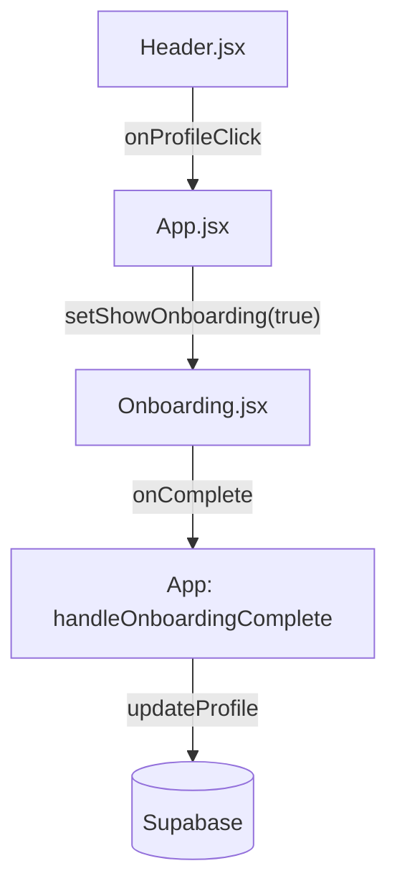

## Context

O sistema já possui um fluxo de salvamento de perfil que associa uma cidade e um estado ao `user_id`. Precisamos apenas expor esse fluxo de forma reativa no cabeçalho.

## Goals / Non-Goals

**Goals:**
- Mostrar a cidade no `Header`.
- Abrir o `Onboarding` ao clicar no perfil/cidade.
- Preencher os campos do `Onboarding` se o usuário já tiver dados salvos.

**Non-Goals:**
- Criar uma página completa de "Configurações".
- Adicionar campos extras ao perfil além de cidade/estado neste momento.

## Decisions

- **Header UI**: Adicionar um botão ou área clicável próxima ao e-mail/avatar que exibe a cidade.
- **Onboarding Prop**: Adicionar `initialData` (objeto com `city` e `state`) ao componente `Onboarding`.
- **App State**: Usar o estado `showOnboarding` já existente no `App.jsx` para abrir o modal.

## Architecture

